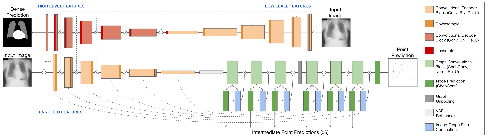

# Joint Dense-Point Representation for Contour-Aware Graph Segmentation

Accepted at MICCAI 2023 (top 14% of submissions). [Paper PDF (Arxiv pre-print)]()

Paper PDF



### Installation 

We use the same installation process as [HybridGNet](https://github.com/ngaggion/HybridGNet), and these dependencies can be installed in a fresh conda environment using:

```conda env create -f environment.yml```

To train and evaluate the Rasterize model, a differentiable rasterization pipeline is required, which can be installed by 
following install instructions for [BoundaryFormer](https://github.com/mlpc-ucsd/BoundaryFormer. 
). We advise that this is created in a separate environment. 

### Datasets

Instructions for download and preprocessing datasets can be found in `Datasets/README.md`

### Training

To train our joint dense-point network from scratch with a HCD loss on the JSRT & Padchest dataset, run the following command:

```
cd Train
python trainerLH_Joint_HCD.py
```

Trainers for all models and baselines are available in `Train/`, where LH (Lungs & Heart) = JSRT & Padchest dataset, and L (Lungs) = Montgomery & Shenzen dataset.
Training weights will be saved to `Results/` dir. 

### Paper Reproducibility 

To reproduce the results in the paper, first download the model weights [here](https://drive.google.com/drive/folders/1V-Ohw1_EbIr4rBnk7h8OgRpvWE-JeyJ4?usp=sharing), and place them in the `weights/`
directory. Run the evaluation scripts in `Evaluate/`, making sure that the directories described in `Evaluate/README.md` have been created. 

### Acknowledgements

Our codebase is adapted from [HybridGNet](https://github.com/ngaggion/HybridGNet). We thank Nicolas Gaggion for his contributions to polygon-based segmentation. This research is part of AI-based Cardiac Image Computing (AICIC) funded by the faculty of Science and Engineering at Queen Mary University of London. 